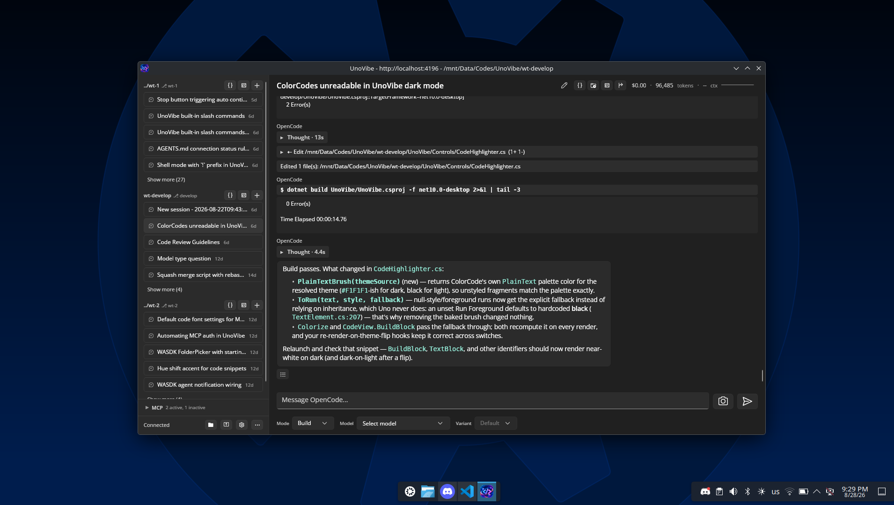

# UnoVibe

A vibecoding frontend application for OpenCode.

Disclaimer: Not affiliated with OpenCode and not built by OpenCode team. And you need to install opencode to use our app.

To get started, you can either run `opencode serve` and connect UnoVibe to it, or UnoVibe can also help start the server for you.
